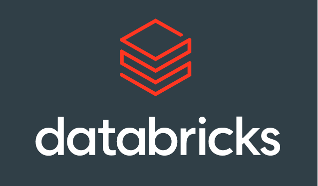

<a href="https://github.com/wiseupdata/wiseupdata">
     
</a> 
<a href="https://github.com/wiseupdata/wiseupdata">
  
</a>
<a href="https://github.com/wiseupdata/wiseupdata">
  
</a>
<a href="https://github.com/wiseupdata/wiseupdata">
  
</a>


---

<a name="readme-top"></a>

<a href="https://github.com/wiseupdata/wiseupdata">

</a>

<h1>
Databricks Utils
</h1>
Useful commands to handle Databricks 🚀. <br>
Shell commands tested 🎯: <br>

- Ubuntu 
- Wsl2 with Windows 11 
- compatible with all Ubuntu and Debian


<br>
<br>

# API cluster examples 🧑‍💻

🛠️ Shell commands:

<details>
<summary>
  Optional, click here ⛏️
</summary>

 - jq `sudo apt install jq`

 > add the | jq . in the end of the commands to a pretty output

</details>
<details>
<summary>
 Credentials set up! Click here 🗝️
</summary>

### 🛂 Create a file with your credentials 

> credentials.sh [file example]
```
#!/bin/bash
API_TOKEN="dap111111111111111111111111-1"
API_END_POINT="https://adb-11111111111111.1.azuredatabricks.net/api/2.0"
USER="user@email.net"
```

###  ⏳ Loading the credentials to environment
```
# load
source credentials.sh

#check
echo $API_END_POINT
```
<br>

</details>

## ☄️ Cluster commands

<details>
<summary>
  🌱 Create a simple cluster, click here
</summary>

```
curl -H "Authorization: Bearer $API_TOKEN" -X POST -H 'Content-Type: application/json' -d '
{
  "cluster_name": "my-cluster",
  "spark_version": "11.3.x-scala2.12",
  "node_type_id": "Standard_D3_v2",
  "spark_conf": {
    "spark.speculation": true
  },
   "autoscale": {
        "min_workers": 1,
        "max_workers": 4
    }
}
' $API_END_POINT/clusters/create
```

</details>

<details>
<summary>
  🌠 Create a Job Workflow with Task, click here
</summary>

> - Manually trigger
> - Single task 
> - Unit Catalog enable
> - Access control declared
>    - First access_control_list is for the Job, the second it's for the new cluster.
> - base_parameters are the parameter that you need to pass to your notebook, Widgets! [Optional]
> - Notebook example

```
curl -H "Authorization: Bearer $API_TOKEN" -X POST -H 'Content-Type: application/json' -d '
{
    "name": "Job task run Hist - Manually",
    "access_control_list": [
            {
                "user_name": "'"$USER"'",
                "permission_level": "CAN_MANAGE"
            }
        ],
    "new_cluster": {
        "autoscale": {
            "min_workers": 1,
            "max_workers": 4
        },
        "spark_version": "11.3.x-scala2.12",
        "spark_conf": {
            "spark.databricks.delta.preview.enabled": "true"
        },
        "azure_attributes": {
            "first_on_demand": 1,
            "availability": "ON_DEMAND_AZURE",
            "spot_bid_max_price": -1
        },
        "node_type_id": "Standard_DS5_v2",
        "driver_node_type_id": "Standard_DS5_v2",
        "ssh_public_keys": [],
        "custom_tags": {},
        "cluster_log_conf": {
            "dbfs": {
                "destination": "dbfs:/cluster-logs"
            }
        },
        "enable_elastic_disk": true,
        "access_control_list": [
            {
                "user_name": "'"$USER"'",
                "permission_level": "CAN_MANAGE"
            }
        ]
    },
    "notebook_task": {
        "task_id": "Your task name",
        "notebook_path": "/note_book_path",
        "base_parameters": {
            "clean_target_path": "True",
            "force_z_order": "True",
            "database": "your_db",
            "env": "your_env",
            "extraction_date": "2023-04-13",
            "layer": "your_layer",
            "legacy_path": "your_path_legacy",
            "primary_key": "pk",
            "table_name": "your_table_name"
        }
    }
}
' $API_END_POINT/jobs/create
```
</details>

<details>
<summary>
  🎢 Run a job, click here
</summary>

```
curl -H "Authorization: Bearer $API_TOKEN" -X POST -H 'Content-Type: application/json' -d '
{ 
  "job_id":583486613168614
}
' $API_END_POINT/jobs/run-now
```

</details>

<details>
<summary>
  🦕 Update Job permissions, click here
</summary>

```
curl -H "Authorization: Bearer $API_TOKEN" -X PATCH -H 'Content-Type: application/json' -d '
{ 
   "access_control_list": [
            {
                "user_name": "'"$USER"'",
                "permission_level": "CAN_MANAGE"
            }
        ]
}
' $API_END_POINT/preview/permissions/jobs/583486613168614
```

</details>

<details>
<summary>
  ☢️ Delete a Job from the workflow., click here
</summary>

```
curl -H "Authorization: Bearer $API_TOKEN" -X POST -H 'Content-Type: application/json' -d '
{ 
  "job_id": 2560589442453
}
' $API_END_POINT/jobs/delete
```

</details>

<details>
<summary>
  😍 Create a Simple Job Workflow with a Task, click here
</summary>

> - Manually trigger
> - Single task 
> - Unit Catalog enable
> - Access control declared
> - Notebook example

```
curl -H "Authorization: Bearer $API_TOKEN" -X POST -H 'Content-Type: application/json' -d '
{
    "name": "Job task run - Manually",
    "existing_cluster_id": "01111-0000-abcddd",
    "access_control_list": [
            {
                "user_name": "'"$USER"'",
                "permission_level": "CAN_MANAGE"
            }
        ],
    "notebook_task": {
        "task_id": "Your task name",
        "notebook_path": "/Users/'"$USER"'/test"
    }
}
' $API_END_POINT/jobs/create
```

</details>

<details>
<summary>
  💣 Delete a cluster, click here
</summary>

```
curl -H "Authorization: Bearer $API_TOKEN" -X POST -H 'Content-Type: application/json' -d '
{ 
  "cluster_id": "0411-102222-j1tg6v6a" 
}
' $API_END_POINT/clusters/delete
```

</details>

<details>
<summary>
   🤖 Get cluster config , click here
</summary>

```
curl -H "Authorization: Bearer $API_TOKEN" -X POST -H 'Content-Type: application/json' $API_END_POINT/clusters/get \
--data '{ "cluster_id": "0111-010002-61n4lz49" }'
```
</details>

<details>
<summary>
   👣 Change the owner of the cluster , click here
</summary>

```
curl -H "Authorization: Bearer $API_TOKEN" -X POST -H 'Content-Type: application/json' $API_END_POINT/clusters/change-owner \
--data '{"cluster_id": "0127-010001-9datovv7", "owner_username": $USER }'
```

</details>

<details>
<summary>
   🕵️ Get user permissions levels in the cluster, click here
</summary>

```
curl -H "Authorization: Bearer $API_TOKEN" -X GET -H 'Content-Type: application/json' $API_END_POINT/permissions/clusters/0110-010002-j8sq1p9s/permissionLevels
```
</details>

<details>
<summary>
   🪁 Get permissions to the cluster, click here
</summary>

```
curl -H "Authorization: Bearer $API_TOKEN" -X GET -H 'Content-Type: application/json' $API_END_POINT/permissions/clusters/0110-010002-j8sq1p9s
```

</details>


<details>
<summary>
   🤝 Give permissions to another user in your cluster, click here
</summary>

```
curl -H "Authorization: Bearer $API_TOKEN" -X PATCH -H 'Content-Type: application/json' $API_END_POINT/preview/permissions/clusters/0406-010001-5ms481wi \
--data '{ "access_control_list": [ { "user_name": $USER, "permission_level": "CAN_MANAGE" } ] }'
```

</details>


<br>

🐍 Python [under construction]

<details>
<summary>
  API cluster examples, click here🔗
</summary>

### Under construction 🛠️

```
echo "wait"
```

</details>

<br>
<br>

# References 🌍 🗄️

1. [Wise Up Data](https://github.com/wiseupdata)
1. [API examples by Microsoft](https://learn.microsoft.com/en-us/azure/databricks/dev-tools/api/latest/clusters)
1. [API examples by Databricks](https://docs.databricks.com/api-explorer/workspace/clusters/createhttps://learn.microsoft.com/en-us/azure/databricks/dev-tools/api/latest/clusters)
1. [Delta rollback](https://delta.io/blog/2022-10-03-rollback-delta-lake-restore/)
1. [API examples by Databricks - Create Jobs](https://docs.databricks.com/dev-tools/api/latest/jobs.html#operation/JobsCreate)
1. [Emojis](https://github.com/wiseupdata/emojis)

<br><br>
---

#### Maintainer 🤗 👨‍💻

Sivio Liborio

📧 silvio.liborio@wiseupdata.com

<a href="https://www.linkedin.com/in/silvio-de-melo-liborio">silvio-de-melo-liborio 
</a>
